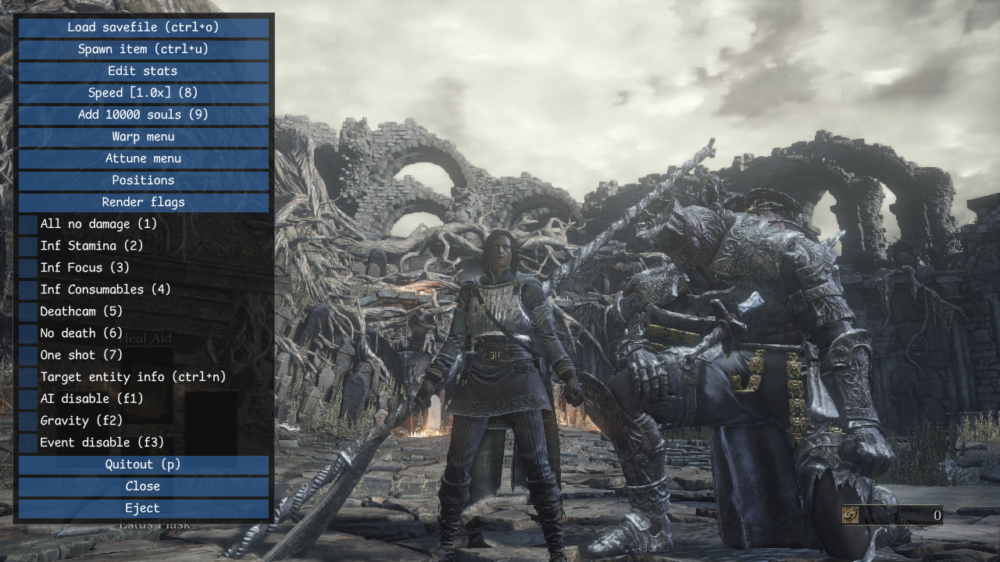

# Dark Souls III Practice Tool

[](https://github.com/veeenu/darksoulsiii-practice-tool/actions)
[](https://github.com/veeenu/darksoulsiii-practice-tool/releases/latest)
[](https://github.com/veeenu/darksoulsiii-practice-tool/blob/main/LICENSE) 
[](https://discord.gg/CVHbN7eF)
[](https://twitch.tv/johndisandonato)
[](https://www.patreon.com/johndisandonato)

A tool for practicing speedruns. Made with ❤️ by [johndisandonato](https://twitch.tv/johndisandonato).

The tool is free, and will always be free for everyone. If you enjoy it, please consider 
[supporting me](https://www.patreon.com/johndisandonato)!



## Getting started

Download the **latest stable release** [here](https://github.com/veeenu/darksoulsiii-practice-tool/releases/latest).

Prerequisites:

- Steam must be open. Offline mode is fine, but the program must be started.
- Antiviruses are disabled. This includes Windows Defender. If you don't want to do that, make sure to whitelist the contents of the practice tool in your antivirus.
- You have a legitimate copy of the game. Pirated copies will never be supported.

## Running the tool

### Standalone

- Extract all files from the zip archive. Anywhere will do.
- Start Dark Souls III.
- Double-click `jdsd_dsiii_practice_tool.exe`.

The tool will automatically appear over the game. Press `0` to open and close its interface.

### Installed

- Extract all files from the zip archive.
- Rename `jdsd_dsiii_practice_tool.dll` to `dinput8.dll`. Make sure your [file extensions are visible](https://www.howtogeek.com/205086/beginner-how-to-make-windows-show-file-extensions/)
  to ensure you are naming the file correctly.
- Copy `dinput8.dll` and `jdsd_dsiii_practice_tool.toml` to you Dark Souls III `Game` folder.
  The files must be in the same folder as `DarkSoulsIII.exe`.
- Start Dark Souls III normally.

The tool is now installed. To load it, start the game, press the right shift button and 
keep it pressed for a few seconds until the tool appears on screen.

If you don't do that, the tool won't load and the game will start normally.

## Running the tool on Linux

The tool fully supports Linux and should run on Steam Deck seamlessly.

### Standalone

If you want to run the tool in a standalone fashion, I recommend [protontricks](https://github.com/Matoking/protontricks):

```sh
protontricks-launch --appid 374320 jdsd_dsiii_practice_tool.exe
```

### Installed

Follow the same instructions as above. Additionally, you have to set the launch options in Steam as follows:

```sh
WINEDLLOVERRIDES="dinput8=n,b" %command%
```

## Help

If the tool doesn't work, you need help, or want to get in touch, read the [troubleshooting guide](TROUBLESHOOTING.md).

If you are looking to submit a patch, check the [contributing guide](CONTRIBUTING.md).

## Credits

- ViRazY for the invaluable help in figuring out Linux support.
- Pav, wasted, jamesq7 for technical help in figuring things out.
- The Cheat Engine table maintained by [The Grand Archives](https://github.com/inunorii/Dark-Souls-III-CT-TGA)
  provided the research base for many of the pointers used in the tool.
- NamelessHoodie[2] and Amir's work on [HoodieScript](https://github.com/NamelessHoodie/HoodieScript)
  for insights about the game's inner workings.
- The Soulsmodding community for the [Param definitions](https://github.com/soulsmods/Paramdex).
- r3sus for the help with anti-cheat ideas, for all the interesting study material / code and
  all the general tips.
- The font used in the UI is [Comic Mono](https://github.com/dtinth/comic-mono-font).

